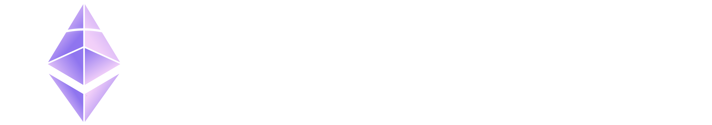
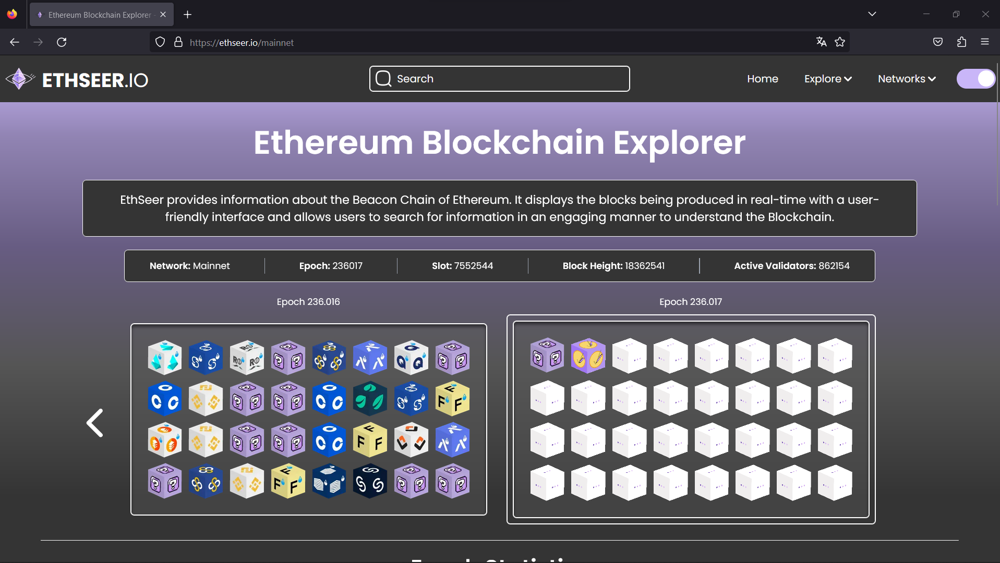
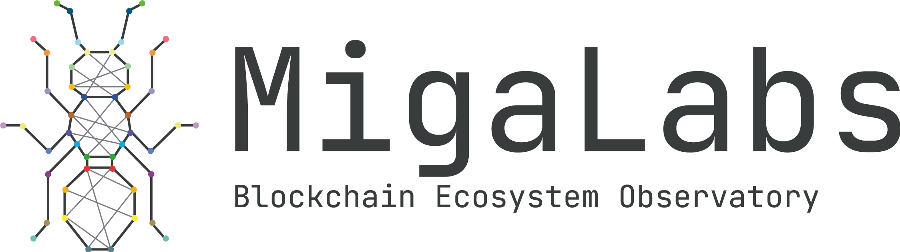

# Introduction
  

<a href="https://www.ethseer.io/">Ethseer.io</a> provides information about the Beacon Chain of Ethereum. It displays the blocks being produced in real-time with a user-friendly interface and allows users to search for information in an engaging manner to understand the Blockchain.


## :ledger: Table of contents

- [Usage](#zap-usage)
  - [Pre-Requisites](#abc-pre-requisites)
  - [Installation](#electric_plug-installation)
  - [Commands](#package-commands)
- [Community](#cherry_blossom-community)
  - [Contribution](#hand-contribution)
  - [Branches](#cactus-branches)
- [Maintainers](#people_hugging-maintainers)
- [Supported Networks](#spider_web-supported-networks)
- [Gallery](#camera-gallery)
- [Acknowledgement](#stars-creditacknowledgment)
- [Contact](#mailbox-contact)
- [License](#lock-license)

## :zap: Usage

### :abc: Pre-requisites
- Before you continue, ensure you have met the following requirements: check you have Node.js installed on your machine. You can download it and install it from [here](https://nodejs.org/).

###  :electric_plug: Installation
1. Clone the repository: 

```jsx
$ git clone https://github.com/migalabs/eth-seer.git
```

Or if you have SSH key:

```jsx
$ git clone git@github.com:migalabs/eth-seer.git
```

2. Create .env file within the `packages/client` and `packages/server` directories. There are examples in both directories of these files. (`packages/client/.env.example` and `packages/server/.env.example`).

### :package: Commands
- To install dependencies:

```jsx
$ npm ci
```

- To run the client:

```jsx
$ cd packages/client
$ npm run app
```

- To run the server:

```jsx
$ cd packages/server
$ npm run build
$ npm run start
```

- Connect to database
An example database connection is:
```
NETWORKS='[
        { "network": "mainnet", "user": "ethseer-reader", "host": <ip>, "name": "ethseer-mainnet", "port": 5432, "password": "pass" },
        { "network": "goerli", "user": "ethseer-reader", "host": <ip>, "name": "ethseer-goerli", "port": 5432, "password": "pass" },
        ]'
```


### :package: Bundle Setup
Ethseer's data is powered by [GotEth](https://github.com/migalabs/goteth). Thus, please refer [to this repository](https://github.com/migalabs/eth-coffee), which contains all the needed configurations to easily run GotEth with Ethseer.

## :cherry_blossom: Community

### :hand: Contribution
Contributions are always welcome and appreciated. If you’d like to contribute to Ethseer, there are several ways you can help:

 1. **Report a bug** <br>
 If you encounter any bugs or have suggestions for improvements, feel free to open an issue [here](https://github.com/migalabs/eth-seer/issues) and we will take care of it.

 2. **Request a feature** <br>
 If you have ideas for new features, feel free to open an issue [here](https://github.com/migalabs/eth-seer/issues) to discuss and propose your ideas.

 3. **Create a pull request** <br>
 If you'd like to contribute directly by implementing new features or fixing bugs, please fork the repository, create a new branch, and submit a pull request [here](https://github.com/migalabs/eth-seer/pulls).

Before submitting a pull request, make sure to:

- Follow the coding style and conventions used in the project.
- Write tests for any new functionality or changes.
- Update the documentation if needed.

 > If you are new to open-source, make sure to check read more about it [here](https://www.digitalocean.com/community/tutorial_series/an-introduction-to-open-source) and learn more about creating a pull request [here](https://www.digitalocean.com/community/tutorials/how-to-create-a-pull-request-on-github).

### :cactus: Branches
1. **`dev`** is the development branch.

2. **`main`** is the production branch.

3. No other permanent branches should be created in the main repository, you can create feature branches but they should get merged with the master.
   
**Steps to work with feature branch**

1. To start working on a new feature, create a new branch prefixed with `feat` and followed by feature name. (ie. `feat-FEATURE-NAME`)
2. Once you are done with your changes, you can raise PR.

**Steps to create a pull request**

1. Make a PR to `dev` branch.
2. Comply with the best practices and guidelines e.g. where the PR concerns visual elements it should have an image showing the effect.
3. It must pass all checks and get positive reviews.

After this, changes will be merged.

## :people_hugging: Maintainers
Thanks go to these wonderful people:

<!-- ALL-CONTRIBUTORS-LIST:START - Do not remove or modify this section -->
<!-- prettier-ignore-start -->
<!-- markdownlint-disable -->
<table align="center">
  <tbody>
    <tr>
      <td align="center" valign="top" width="14.28%"><a href="https://github.com/leobago"><br /><sub><b>Leonardo Bautista-Gomez</b></sub></a><br /></td>
      <td align="center" valign="top" width="14.28%"><a href="https://github.com/tdahar"><br /><sub><b>Tarun Mohandas Daryanani</b></sub></a><br /></td>
      <td align="center" valign="top" width="14.28%"><a href="https://github.com/cortze"><br /><sub><b>Mikel Cortes-Goicochea</b></sub></a><br /></td>
      <td align="center" valign="top" width="14.28%"><a href="https://github.com/santi1234567/"><br /><sub><b>Santiago Somoza</b></sub></a><br /></td></tr>
      <td align="center" valign="top" width="14.28%"><a href="https://github.com/josepchetrit12"><br /><sub><b>Josep Chetrit</b></sub></a><br /></td>
      <td align="center" valign="top" width="14.28%"><a href="https://github.com/IuriPons"><br /><sub><b>Iuri Pons</b></sub></a><br /></td>
      <td align="center" valign="top" width="14.28%"><a href="https://github.com/Artentii"><br /><sub><b>Marina Terentii Cebotari</b></sub></a><br /></td>
      <td align="center" valign="top" width="14.28%"><a href="https://github.com/mpujadas"><br /><sub><b>Marc Pujadas</b></sub></a><br /></td>
    </tr>
  </tbody>
</table>
<!-- markdownlint-restore -->
<!-- prettier-ignore-end -->

<!-- ALL-CONTRIBUTORS-LIST:END -->

## :spider_web: Supported Networks
Ethseer is compatible with the following Blockchain networks:

- **Mainnet:** The primary Ethereum network used for transactions and contracts in the production environment.
- **Goerli:** A test network for Ethereum, used for development and testing without using real ETH.

When using Ethseer, make sure to configure the appropriate network based on your needs, whether it's for operations on the main network (Mainnet) or for testing in a development environment (Goerli).

## :camera: Gallery
Enjoy the experience here:



<p align="center"><a href="https://ethseer.io/"></a></p>

## :stars: Credit/Acknowledgment
This project was done by our Migalabs team. Feel free to check our website and other services we offer [here](https://migalabs.io/).


## :mailbox: Contact
If you have any questions related to our platform, projects or services, please don't hesitate to contact us <a href="mailto:migalabs@protonmail.com">here</a>.

- **Say hello :wave:** :
   - <a href="https://twitter.com/miga_labs?ref_src=twsrc%5Egoogle%7Ctwcamp%5Eserp%7Ctwgr%5Eauthor">Twitter</a>
   - <a href="https://discord.com/invite/DzVUQAgmcw">Discord</a>

## :lock: License
Ethseer is licensed under the [BSD-3-Clause](https://opensource.org/license/bsd-3-clause/) License.

**[⬆ back to top](#ledger-table-of-contents)**
